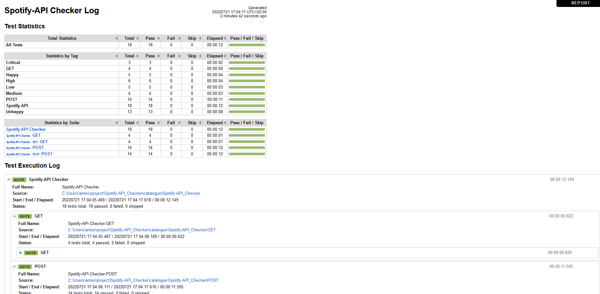
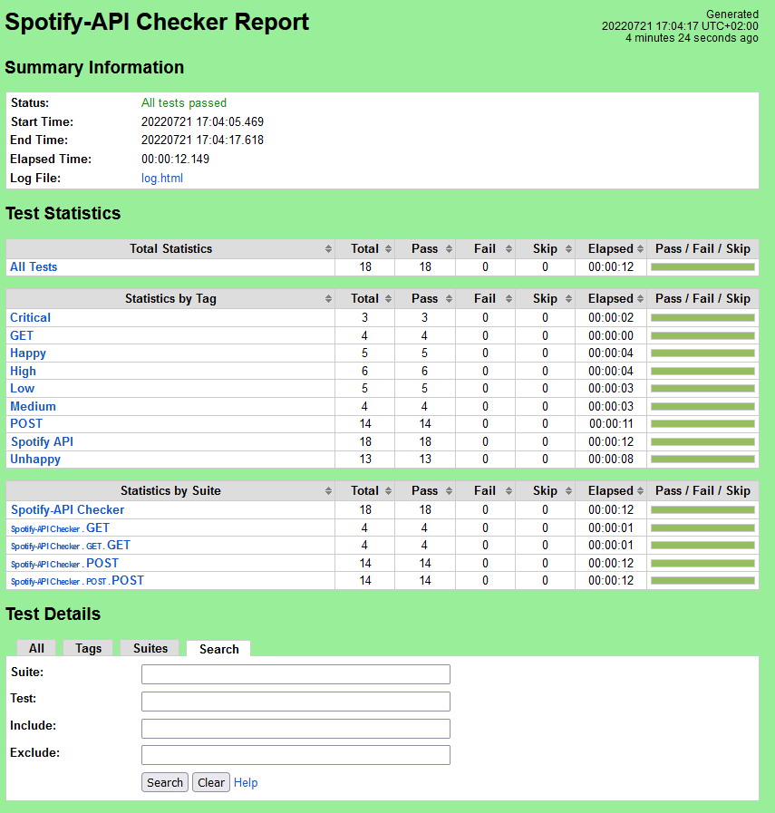

# Spotify-API Checker
This is a project to generate a tests catalogue with Spotify public API

## Details
For this project I will use [Spotify public API](https://developer.spotify.com/) to check the **Get an Artist** and **Create a Playlist** process.

### Language 
I'm going to use *Python 3.8.8*

### Framework
I'm going to use [robotframework](https://robotframework.org/) as automation framework with python.

### Environment
I'm going to use a [virtual python environment](https://docs.python.org/3/tutorial/venv.html) and use **requirements.txt** to install the packages.

## Objective
I design a tests catalogue with [Gherkin Syntax](https://cucumber.io/docs/gherkin/).

The endpoints in scope are:
1. Get an Artist
```
GET [https://api.spotify.com/v1/artists/{id}]
```
2. Create a Playlist
```
POST [https://api.spotify.com/v1/users/{user_id}/playlists]
```

## Quick Start

### Installation

Create your virtual environment.
```bash
python -m venv .env
```

Install the needs library from **requirements.txt**
```bash
pip install -r requirements.txt
```

Init your virtual environment
```bash
source .env/Scripts/activate
```

### Execute with Authorization token
This is the only way to execute all the tests suites. Because you need access user information for **POST test suite**.

Generate the access Token with the following scopes:
1. playlist-modify-public
1. playlist-modify-private
1. user-read-private
1. user-read-email

```bash
python -m robot --pythonpath ./src/ --outputdir ./testExecutionResults/ -v clientId:{put here your clientId} -v clientSecret:{put here your clientSecret} -v authorizeToken:{put here your authorize token} catalogue/Spotify-API_Checker/
```

### Execute with client credentials
This is the option when you can't obtain an **authorize Token**. This execution doesn't have access user information and you only can execute **GET test suite**.

```bash
python -m robot --pythonpath ./src/ --outputdir ./testExecutionResults/ -v clientId:{put here your clientId} -v clientSecret:{put here your clientSecret} -i GET catalogue/Spotify-API_Checker/
```

### Show result

After the execution you can see all the process in the console, but you can open **testExecutionResults/log.html** and **testExecutionResults/resport.html**.


